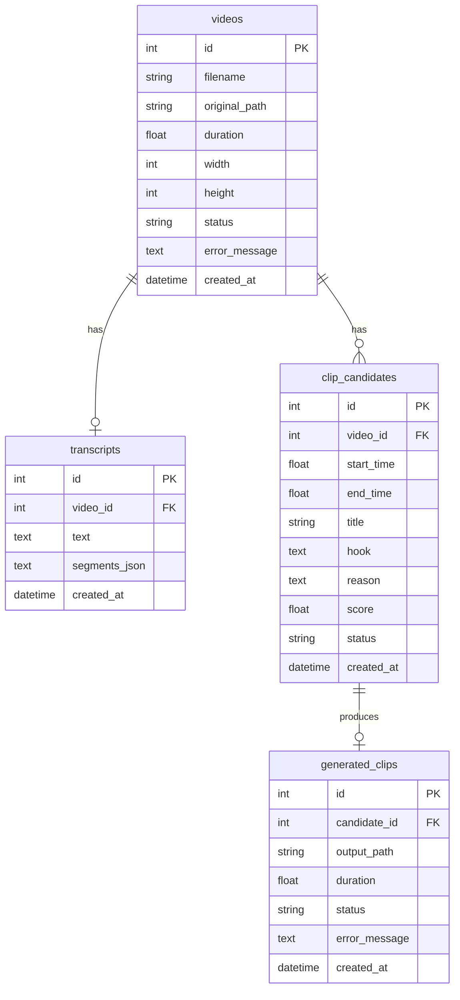

# Data Model

Current persistence: **SQLite** via SQLAlchemy (`DATABASE_URL`, default `sqlite:///./data/app.db`).

Only models that exist in `app/db/models.py` are documented as current.

## ER (ASCII)

```
Video 1──1 Transcript
Video 1──* ClipCandidate
ClipCandidate 1──0..1 GeneratedClip
```

## ER (Mermaid)



---

## Video (`videos`)

**Purpose:** Uploaded source video and pipeline status.

| Field | Type | Notes |
|---|---|---|
| `id` | int PK | autoincrement |
| `filename` | string(512) | sanitized display/storage name |
| `original_path` | string(1024) | absolute/local path under `data/uploads` |
| `duration` | float nullable | seconds from ffprobe |
| `width` | int nullable | pixels |
| `height` | int nullable | pixels |
| `status` | string(32) | see statuses below |
| `error_message` | text nullable | last failure message |
| `created_at` | datetime tz | UTC |

**Relationships:** optional one `Transcript`; many `ClipCandidate`.

**Status values:** `uploaded`, `queued`, `ingesting`, `transcribing`, `analyzing`, `selecting`, `clipping`, `rendering`, `completed`, `failed`.

---

## Transcript (`transcripts`)

**Purpose:** Full transcript + timestamped segments for analysis/subtitles.

| Field | Type | Notes |
|---|---|---|
| `id` | int PK | |
| `video_id` | int FK unique | → `videos.id` CASCADE |
| `text` | text | full concatenated transcript |
| `segments_json` | text | JSON list of `{start,end,text}` |
| `created_at` | datetime tz | |

**Constraints:** one transcript per video.

---

## ClipCandidate (`clip_candidates`)

**Purpose:** LLM-proposed (then validated/selected) short-form moments.

| Field | Type | Notes |
|---|---|---|
| `id` | int PK | |
| `video_id` | int FK indexed | → `videos.id` CASCADE |
| `start_time` | float | seconds |
| `end_time` | float | seconds |
| `title` | string(256) | |
| `hook` | text | |
| `reason` | text | |
| `score` | float | LLM score 0–10 (pre-adjustment stored) |
| `status` | string(32) | see below |
| `created_at` | datetime tz | |

**Status values:** `pending`, `selected`, `rejected`, `rendered`, `failed`.

**Relationships:** optional one `GeneratedClip`.

---

## GeneratedClip (`generated_clips`)

**Purpose:** Rendered vertical short linked to a selected candidate.

| Field | Type | Notes |
|---|---|---|
| `id` | int PK | |
| `candidate_id` | int FK unique | → `clip_candidates.id` CASCADE |
| `output_path` | string(1024) | under `data/clips/...` |
| `duration` | float nullable | probed after render |
| `status` | string(32) | `pending` / `processing` / `completed` / `failed` |
| `error_message` | text nullable | render/quality issues |
| `created_at` | datetime tz | |

---

## File-backed data (not DB tables)

| Path | Contents |
|---|---|
| `data/uploads/` | original videos |
| `data/transcripts/video_{id}.json` | transcript dump |
| `data/clips/video_{id}/` | SRT/ASS + final MP4s |
| `data/temp/` | intermediate audio/cuts |

---

## PLANNED models (not implemented)

- Campaign / CampaignBrief
- SocialAccount
- PublishJob
- ClipMetrics / Earnings
- User / Auth / Tenant
